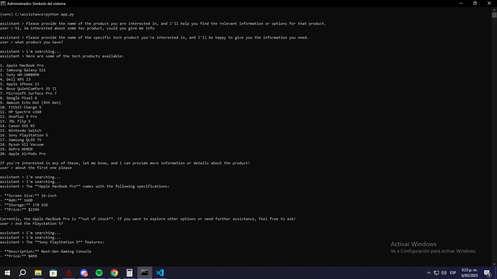

# QA Test Report - Purchase Assistant

## Introduction  
This document describes the Quality Assurance (QA) tests conducted on the **Purchase Assistant**, an AI-based shopping assistant that interacts with users and provides product-related information using the OpenAI API.  

The objective of this report is to validate the correct functionality of the assistant, identify potential errors, and ensure robustness against different input scenarios.  

## Test Environment  
- **Operating System:** Windows 10  
- **Programming Language:** Python 3.8+  
- **Dependencies:**  
  - OpenAI API  
  - dotenv  
  - typing_extensions  
- **Required Files:** `catalog.json`, `.env`  
- **Environment Variable:** `OPENAI_API_KEY` properly configured  
- **Repository:** [GitHub link]  

---

## 1. Function `get_all_products`  
**Objective:** Ensure that the assistant returns the list of products.  
**Test:** Asked `"What products are available?"`.  
**Expected Result:** It should display all products from `catalog.json`.  
**Actual Result:** The assistant correctly retrieved and displayed the full list of products.  

#### Chat Output  
After completing the flow and requesting the available products, the assistant correctly retrieves and displays the full list from `catalog.json`:  

  

#### Verification of `catalog.json`  
To confirm that the assistant is pulling data correctly, we checked `catalog.json` and verified that all products are properly stored:  

  
  
  

Trying show a inexistent product similar to a product available the flow is showing correctly 

  

#### **Test with an Empty Catalog**  
When `catalog.json` was empty (`[]`), the assistant returned an unclear error message:  

  
 
Unclear message from the assitance:

 

---

## 2. Function `get_product_info`  
**Objective:** Validate that the assistant provides correct product information.  
**Test:** Asked `"I want information about Apple iPhone 13."`  
**Expected Result:** The assistant should return the product name, description, and price from `catalog.json`.  
**Actual Result:** The assistant correctly retrieved and displayed the information.  

#### Chat Output  
After requesting details for the iPhone 13, the assistant provided the expected response:  

### 2.1 Handling Non-Existent Products  
**Objective:** Verify that the assistant correctly handles requests for products that are not in `catalog.json`.  
**Test:** Asked `"I want information about Samsung Galaxy S1000."`  
**Expected Result:** The assistant should respond with `"Product not found."` or suggest an alternative.  
**Actual Result:** The assistant provided a clear response indicating that the product was not available and suggested an alternative (Samsung Galaxy S21).  

#### Chat Output  
When requesting information about a non-existent product, the assistant handled it correctly:  

  

### 2.2 Handling Case Sensitivity and Minor Typos  
**Objective:** Verify that the assistant correctly recognizes product names regardless of case sensitivity and small typos.  
**Test:** Asked for `"apple iphone 13"` using different capitalizations and a minor typo.  
**Expected Result:** The assistant should recognize `"Apple iPhone 13"` correctly in all cases.  
**Actual Result:** The assistant successfully retrieved product information in all cases, including when using:  

1️ **All lowercase:** `"i want information about apple iphone 13"`  
2️ **All uppercase:** `"I WANT INFORMATION ABOUT APPLE IPHONE 13"`  
3️ **Minor typo:** `"i want information about aplle iphone 13"`  

#### Chat Output  
The assistant correctly handled case variations and a minor typo in a single test session:  

### 2.3 Handling Partial Matches and Extra Spaces  
**Objective:** Verify that the assistant correctly recognizes product names even if the user provides incomplete input or extra spaces.  

#### **Case 1: Partial Matches**  
- **Tested Query:** `"I want information about iPhone"`  
- **Expected Response:** The assistant should recognize `"Apple iPhone 13"` as the intended product.  
- **Actual Response:** The assistant successfully identified `"Apple iPhone 13"` and provided the correct details.  

#### **Case 2: Extra Spaces in the Query**  
- **Tested Query:** `"I want information about    Apple   iPhone   13"`  
- **Expected Response:** The assistant should process the query correctly and return the expected product details.  
- **Actual Response:** The assistant ignored unnecessary spaces and retrieved the correct information for `"Apple iPhone 13"`.  

#### Chat Output  
The assistant successfully handled both cases in a single test session:  

---

### 3 Checking Stock for Existing Products  
**Objective:** Verify that the assistant correctly retrieves stock availability for products listed in `catalog.json`.  

#### **Test Case: Samsung Galaxy S21**  
- **Tested Query:** `"How many Samsung Galaxy S21 are available?"`  
- **Expected Response:** `"The Samsung Galaxy S21 is in stock with availability: 30 units."`  
- **Actual Response:** The assistant successfully retrieved and displayed the correct stock information.  

#### Chat Output  
The assistant correctly provided the stock information:  

   

### 3.1 Handling Non-Existent Products  
**Objective:** Verify that the assistant correctly responds when a user requests stock information for a product that is not listed in `catalog.json`.  

#### **Test Case: Oppo (Non-Existent Product)**  
- **Tested Query:** `"How many Oppo are available?"`  
- **Expected Response:** `"It seems there are currently no Oppo products available in the list I have."`  
- **Actual Response:** The assistant correctly handled the request and provided a clear response.  

#### Chat Output  
When requesting stock information for a non-existent product, the assistant handled it correctly:  

 

### 3.2 Handling Out-of-Stock Products  
**Objective:** Verify that the assistant correctly informs when a product is unavailable due to zero stock.  

#### **Test Case: Apple MacBook Pro (Stock = 0)**  
- **Tested Query:** `"Apple MacBook Pro how many are available?"`  
- **Expected Response:** `"The Apple MacBook Pro is currently out of stock."`  
- **Actual Response:** The assistant successfully identified the product as out of stock and provided the correct response.  

#### Chat Output  
The assistant correctly handled an out-of-stock product:  

### 3.3 Requesting Stock Without Specifying a Product  
**Objective:** Verify that the assistant correctly handles cases where the user asks for stock availability without specifying a product.  

#### **Test Case: No Product Specified**  
- **Tested Query:** `"How many are available?"`  
- **Expected Response:** `"Could you please specify the name of the product you're interested in so I can check the stock availability for you?"`  
- **Actual Response:** The assistant successfully requested clarification instead of failing.  

#### Chat Output  
The assistant correctly asked the user to specify a product:  

  

---

## 4. Full Interaction Flow  
**Objective:** Validate that the assistant correctly handles a complete user session, from general inquiries to specific product details and stock availability.  

#### **Test Scenario:**  
1. **User:** `"I'm interested in some tech product, could you give me info?"`  
2. **Assistant:** Requests a more specific product name.  
3. **User:** `"What products do you have?"`  
4. **Assistant:** Lists all available products from `catalog.json`.  
5. **User:** `"About the first one, please."`  
6. **Assistant:** Provides detailed information about `"Apple MacBook Pro"`, mentions it's **out of stock**.  
7. **User:** `"And the PlayStation 5?"`  
8. **Assistant:** Provides details for `"Sony PlayStation 5"`, mentions it's **in stock (20 units)**.  
9. **User:** `"OK, bye."`  
10. **Assistant:** Politely ends the conversation.  
11. **User:** `"END"`  
12. **Assistant:** `"Chat is finished."`  

#### **Chat Output**  
The assistant successfully handled the full interaction flow:  

  

### **Test Scenario:**  
1. User: `"I'm looking for a PlayStation 5"`  
2. Assistant: `"I'm searching..."`  
3. Assistant initially failed to retrieve PlayStation 5 information despite being in the catalog (error).  
4. User: `"What products are available?"`  
5. Assistant correctly lists all available products.  
6. User: `"How many iPhone 13 units do you have?"`  
7. Assistant correctly responds: `"25 units available."`  
8. User: `"How many OnePlus 9 Pro units are available?"`  
9. Assistant correctly responds: `"22 units available."`  
10. User: `"I need 20 units."`  
11. Assistant: `"You can proceed with your purchase."`  

---
## Error Handling  

| **Error** | **Description** | **Solution** |  
|-----------|---------------|-------------|  
| Empty input | Entering a blank message caused `BadRequestError` | Added input validation to ignore empty messages |  
| Product not found | Searching for `"Tablet XYZ"` returned `"I couldn't find any information or stock availability..."` instead of failing | The assistant correctly handled the error by suggesting the user check the name |  
| Empty catalog | If `catalog.json` is empty (`[]`), the assistant responds with `"It seems there was an issue retrieving the list of available products."` instead of `"No products available."` | Improved error handling to return a clearer message when `catalog.json` is empty |  
| Out of stock | Querying `"Apple MacBook Pro"` when stock was set to `0` returned `"The product is out of stock."` | The assistant handled this correctly; no fix was needed |  
| Unspecified product | Asking `"How many are available?"` without specifying a product triggered a request for clarification | The assistant correctly asked the user to specify a product |  

---

## Improvement Recommendations  
- **Better validation of product names** to avoid search errors.  
- **Clearer response formatting** (e.g., ordered lists in output).  
- **Handling of code injection attempts** for security.  

---

## Submission Evidence  
- **GitHub Repository:** [Link to the repo]  
- **Submission Video:** [Link to the video]  
